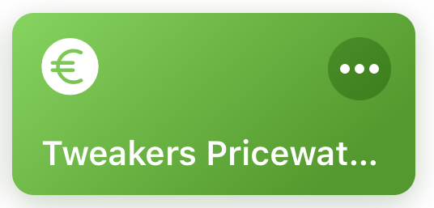
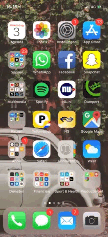
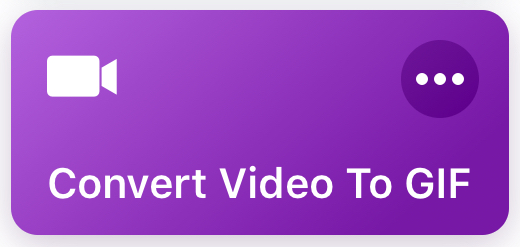

# iOS Siri Shortcuts
A collection of shortcuts for the [Apple Shortcuts app](https://itunes.apple.com/us/developer/apple/id642218247?mt=8).

#### [Handy dandy](#handy-dandy)
- [Tweakers Pricewatch - Dutch](#tweakers-pricewatch)
- [Convert Video To Gif](#convert-video-to-gif)

#### [Miscellaneous](#miscellaneous)
- [Nicolas Cage Mania](#nicolas-cage-mania)

#### [Third party](#third-party)

# Handy dandy

## Tweakers Pricewatch
[back to top](#readme) 
### Description
This Shortcut will enable you to quickly look up prices for products via [tweakers.net](https://tweakers.net/). This can be done within Safari by selecting text followed by running this shortcut or as widget by text/Siri.

  

### Installation
Click [here](shortcuts/Tweakers%20pricewatch.shortcut?raw=true) to install.

## Convert Video To Gif
[back to top](#readme) 
### Description
Easily convert your video to gif.

### Installation
Click [here](shortcuts/Convert%20Video%20To%20GIF.shortcut?raw=true) to install.

# Miscellaneous

## Nicolas Cage Mania
[back to top](#readme) 
### Description
This Shortcut will replace all images in your Safari webpage with Mr Nicolas Cage.

### Installation
Click [here](shortcuts/Nicolas%20Cage.shortcut?raw=true) to install.

# Third party
[back to top](#readme) 
...
